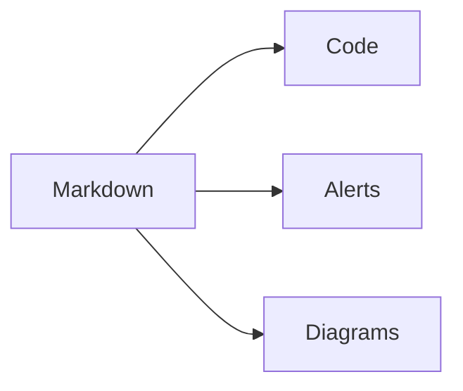

This route is a compact rendering reference for Markdown-heavy posts. It shows
how callouts, code fences, tables, diagrams, media, and fallback artifact links
look inside the same article layout used by regular Papyrus posts.

## Obsidian callout syntax

> [!NOTE]
> Notes render as theme-aware callouts while keeping the original Markdown
> readable in source form.

> [!TIP]
> Tips use the same callout component shape with a different token mix.

> [!IMPORTANT]
> Important callouts use their own icon and color so they are distinct from tips.

> [!WARNING]
> Warning variants use warning tokens instead of hardcoded colors.

> [!CAUTION]
> Caution callouts stay readable in light and dark modes.

## Code title

```rust title="src/main.rs"
fn main() {
    println!("papyrus");
}
```

## Diff fence

```css title="diff.css"
.papyrus-card {
  background: var(--papyrus-panel); /* [!code --] */
  background: transparent; /* [!code ++] */
  color: var(--papyrus-accent); /* [!code ++] */
}
```

## Highlighted lines

```c title="highlight.c"
#include <stdio.h>

int main(void) {
  puts("papyrus"); // [!code highlight]
  return 0;
}
```

## Console fences

```console
site$ pnpm install
site# pnpm build
site> pnpm preview
```

## Task list

- [x] Keep feature walkthroughs explicit
- [ ] Document the source files beside rendered artifacts
- [ ] Choose a renderer before embedding external diagram formats

## Table

| Feature | Expected behavior |
| --- | --- |
| Code title | Render a compact title bar |
| Diff | Style added and removed lines |
| Table | Stay readable without heavy borders |

## Mermaid fence



## Image zoom


## Artifact links

- [Mermaid source](/demo/theme-flow.mmd "Hydrated Mermaid source")
- [PlantUML source](/demo/call-flow.puml "PlantUML source")
- [Excalidraw source](/demo/sketch.excalidraw "Excalidraw source")

## Fallback rendering

Some GitHub-style or diagram-adjacent formats need a site-owned plugin or
renderer. Papyrus keeps the source visible so authors can choose the right
integration for their site.
