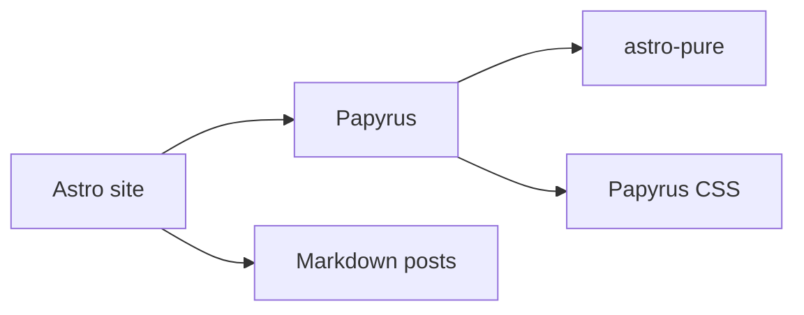

Papyrus uses regular Astro Markdown. A post stays readable as plain text and
builds into an article page with source, share, tag, table-of-contents, and
metadata actions when the site enables them.

This page is a quick rendering reference. Every section below is ordinary
Markdown that a real post can use.

## Headings

# H1 inside content

## H2 inside content

### H3 inside content

#### H4 inside content

##### H5 inside content

###### H6 inside content

## Paragraph features

Normal text remains readable. **Bold text**, *italic text*, ***bold italic text***, ~~strikethrough text~~, `inline code`, and [normal links](https://astro.build/) all sit cleanly in a paragraph.

Autolinks stay visible: https://github.com/marcelofpfelix/papyrus

Escaped characters remain literal: \*not italic\* and \`not code\`.

## Images


## Lists

Unordered list:

- keep the site repo focused on content and configuration
- import reusable components from `astro-papyrus`
- avoid copying a whole upstream theme into each site
- keep overrides small enough to review

Ordered list:

1. Write the post in `src/content/posts`.
2. Let Astro build the static route.
3. Use Papyrus layouts for repeated post UI.

Nested list:

- Theme
  - layout
  - post list
  - prose styles
- Site
  - content
  - config
  - minimal pages

Task list:

- [x] base layout
- [x] post layout
- [x] search entry point
- [ ] graph view

## Table

| Feature | Type | Current state |
| --- | --- | --- |
| RSS | feed | working |
| Tags | metadata | route and search filter |
| Archive | index | visible when hidden posts exist |
| Graph view | data | generated from the AI graph export |

Right and center alignment:

| Left | Center | Right |
| :--- | :---: | ---: |
| alpha | beta | 10 |
| longer value | middle | 200 |

## Blockquotes

> A good theme makes normal markdown readable before it adds more features.

Nested quote:

> First level
>
> > Second level

## GitHub alerts

> [!NOTE]  
> Notes are calm and readable.

> [!TIP]  
> Tips stand out without becoming noisy.

> [!IMPORTANT]  
> Important text is easy to scan.

> [!WARNING]  
> Warnings stay visible in both light and dark mode.

> [!CAUTION]  
> Caution blocks keep the page rhythm intact.

## Code

Inline code like `pnpm build` keeps paragraph line-height calm.

TypeScript with a title and highlighted lines:

```ts title="src/pages/posts/index.astro" {1,4}
import { PapyrusBaseLayout, PapyrusPostList } from "astro-papyrus/components";
import { publishedPosts } from "astro-papyrus/utils";

const posts = publishedPosts(await getCollection("posts"));
```

Rust:

```rust title="src/main.rs" {1,9-12}
#[derive(Debug, Clone)]
struct Repo {
    owner: String,
    name: String,
}

impl Repo {
    fn slug(&self) -> String {
        format!("{}/{}", self.owner, self.name)
    }
}

fn main() {
    let repo = Repo {
        owner: "marcelofpfelix".into(),
        name: "papyrus".into(),
    };

    println!("{}", repo.slug());
}
```

Diff with add/remove line styling:

```diff title="papyrus.css"
- .papyrus-icon-button:hover {
-   background: var(--papyrus-panel);
-   border-color: var(--papyrus-accent);
- }
+ .papyrus-icon-button:hover {
+   background: transparent;
+   color: var(--papyrus-accent);
+ }
```

Shell:

```sh
pnpm install
pnpm build
pnpm papyrus-llms src/content/posts public "$SITE_URL"
```

## Mermaid



Diagram source links:

[Mermaid source](/demo/theme-flow.mmd "Open the Mermaid source file")

[PlantUML source](/demo/call-flow.puml "Open the PlantUML source file")

[Excalidraw sketch](/demo/sketch.excalidraw "Open the editable Excalidraw file")

## Link preview

<a class="papyrus-link-preview" href="https://astro.build/">
  <span>
    <strong>Astro</strong>
    <small>The web framework used by this blog and theme wrapper.</small>
    <em>astro.build</em>
  </span>
</a>

## Footnotes

Footnotes are useful for small asides without breaking the main flow.[^1]

[^1]: This is a GitHub-style footnote.

## Definition list

Papyrus
: reusable layouts, components, and CSS

Site
: content, config, and route composition

## Details

<details>
<summary>Raw HTML details block</summary>

This checks whether HTML inside markdown keeps spacing and typography.

</details>

## Horizontal rule

---

The content after the rule stays connected to the rest of the post.

## What this page shows

Public posts can double as useful documentation. Readers see how authoring
features work, and maintainers get one page that covers headings, prose, images,
lists, callouts, code, diagrams, artifact links, link previews, footnotes,
definition lists, and raw HTML details.
