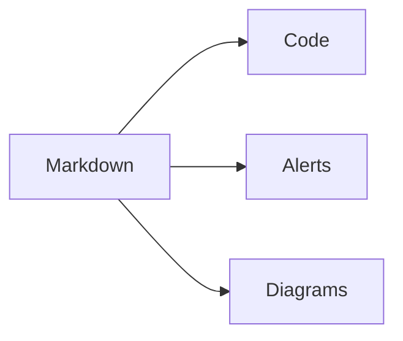

This route is a compact rendering reference for Markdown-heavy posts. It shows
how callouts, code fences, tables, diagrams, media, and fallback artifact links
look inside the same article layout used by regular Papyrus posts.

## Obsidian callout syntax

> [!NOTE]
> Notes render as theme-aware callouts while keeping the original Markdown
> readable in source form.

> [!TIP]
> Tips use the same callout component shape with a different token mix.

> [!IMPORTANT]
> Important callouts use their own icon and color so they are distinct from tips.

> [!WARNING]
> Warning, tip, important, and caution variants use theme tokens instead
> of hardcoded colors.

> [!CAUTION]
> Caution callouts stay readable in light and dark modes.

> [!INFO]
> Neutral context can use the broader Obsidian callout set, not only the
> GitHub five alert variants.

> [!SUCCESS]
> Success callouts render with their own icon and color.

> [!WARNING]- Collapsed warning
> This content starts collapsed without any client-side JavaScript.

> [!TIP]+ Expanded tip
> This content starts open and can be collapsed.

## Code title

```rust title="src/main.rs"
fn main() {
    println!("papyrus");
}
```

## Rust block

```rust
struct ThemeProfile {
    name: &'static str,
    dark_mode: bool,
}

fn active_profile() -> ThemeProfile {
    ThemeProfile {
        name: "gruvbox",
        dark_mode: true,
    }
}
```

## Diff fence

```css title="diff.css"
.paper-card {
  background: var(--paper-panel); /* [!code --] */
  background: transparent; /* [!code ++] */
  color: var(--paper-accent); /* [!code ++] */
}
```

## Highlighted lines

```c title="highlight.c"
#include <stdio.h>

int main(void) {
  puts("papyrus"); // [!code highlight]
  return 0;
}
```

## Console fences

```console
site$ pnpm install
site# pnpm build
site> pnpm preview
```

## Collapsed block

```rust title="src/server.rs"
fn boot() {
    println!("line 1");
    println!("line 2");
    println!("line 3");
    println!("line 4");
    println!("line 5");
    println!("line 6");
    println!("line 7");
    println!("line 8");
    println!("line 9");
    println!("line 10");
    println!("line 11");
    println!("line 12");
    println!("line 13");
    println!("line 14");
    println!("line 15");
    println!("line 16");
}
```

## Task list

- [x] Keep feature walkthroughs explicit
- [ ] Document the source files beside rendered artifacts
- [ ] Choose a renderer before embedding external diagram formats

## GitHub-style inline Markdown

Autolinks like https://github.com/marcelofpfelix/papyrus stay
clickable, `inline code` keeps code styling, and ~~strikethrough~~ stays
visible when the markdown pipeline supports it.

## Table

| Feature | Expected behavior |
| --- | --- |
| Code title | Render a compact title bar |
| Diff | Style added and removed lines |
| Table | Stay readable without heavy borders |

## Mermaid fence



## Image zoom


## Artifact links

- [Mermaid source](/demo/theme-flow.mmd "Hydrated Mermaid source")
- [PlantUML source](/demo/call-flow.puml "PlantUML source")
- [Excalidraw source](/demo/sketch.excalidraw "Excalidraw source")

## Fallback rendering

Some GitHub-style or diagram-adjacent formats need a site-owned plugin or
renderer. Papyrus keeps the source visible so authors can choose the right
integration for their site.

| Case | Theme behavior |
| --- | --- |
| PlantUML inline rendering | Keep as a file link until a renderer is configured. |
| Excalidraw inline rendering | Keep as a file link until an export or render path is configured. |
| Wiki links like `[[topic]]` | Keep as plain text unless a backlink plugin is added. |
| Footnotes like `[^1]` | Render when a consuming site adds a footnote plugin. |
